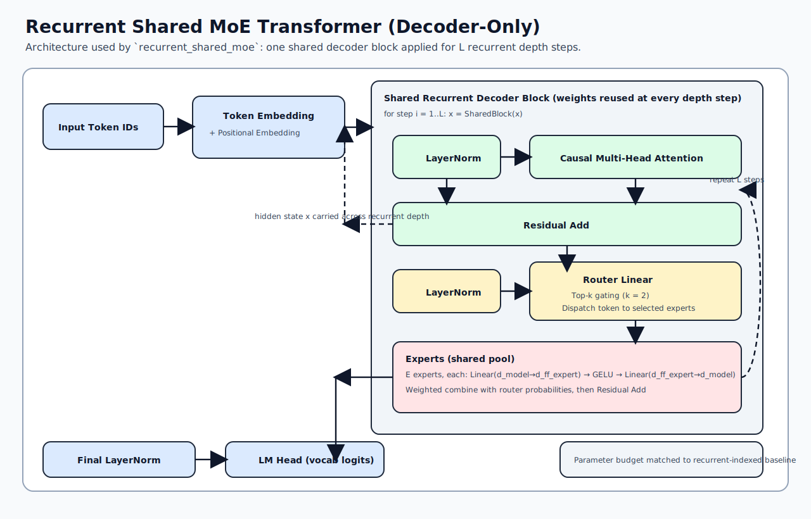
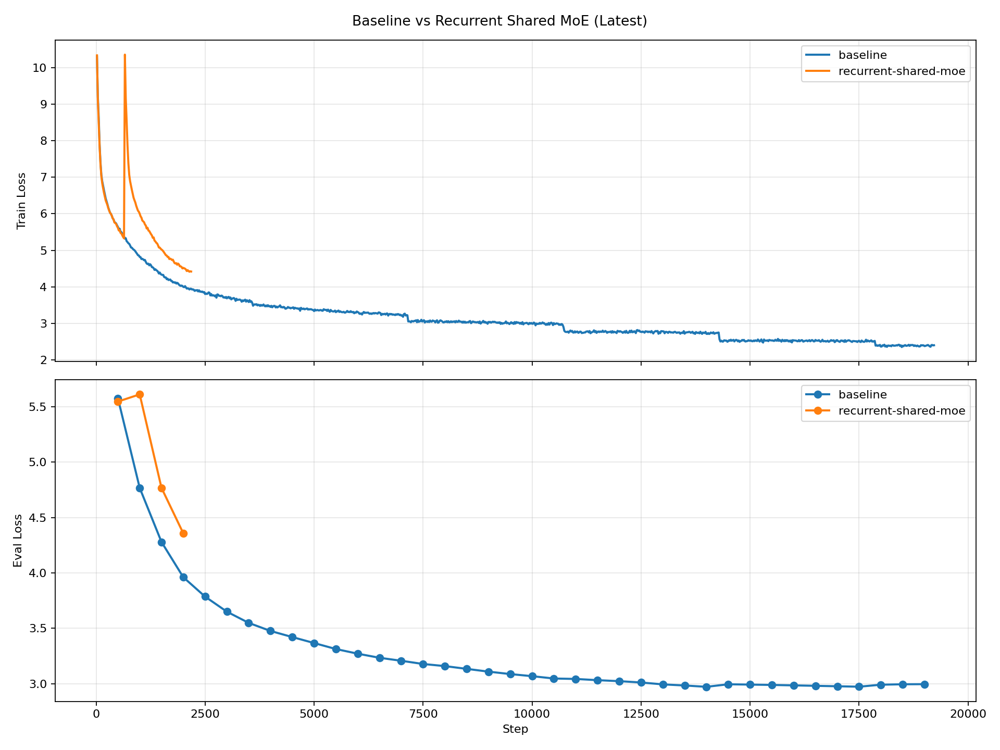

# rnn-transformer baseline

This repo now contains a Tier-A dense baseline aligned with the research plan PDF:
- Model scale: ~300M parameters (`20` layers, `1024` hidden, `16` heads)
- Task: decoder-only language modeling
- Dataset: `wikitext-103-raw-v1`
- Optimizer: `AdamW`
- LR schedule: cosine decay + warmup
- Context length: `1024`

## Files
- `train_baseline.py`: training entrypoint
- `configs/baseline_300m_wikitext103.json`: baseline config
- `scripts/run_300m_baseline.sh`: run script
- `scripts/setup_python_env.sh`: host setup helper

## Setup

```bash
cd /home/chenshen/rnn-transformer
./scripts/setup_python_env.sh
```

## Train

```bash
cd /home/chenshen/rnn-transformer
source .venv/bin/activate
wandb login
export WANDB_PROJECT=rnn-transformer
export WANDB_NAME=baseline-300m-wikitext103
./scripts/run_300m_baseline.sh
```

## Quick smoke test

```bash
cd /home/chenshen/rnn-transformer
source .venv/bin/activate
python train_baseline.py \
  --config configs/baseline_300m_wikitext103.json \
  --max_steps 20 \
  --output_dir runs/smoke_300m
```

## Recurrent Baseline Equivalence

Run the strict equivalence gate (stacked vs recurrent step-indexed):

```bash
cd /home/chenshen/rnn-transformer
source .venv/bin/activate
python scripts/check_recurrent_equivalence.py
```

Success criteria (from plan):
- `max_abs_diff_logits < 1e-5`
- `grad_cosine > 0.999`

## Recurrent Shared MoE (Fixed 40 Experts, Top-2)

Run the shared recurrent MoE training with top-k routing and auto resume:

```bash
cd /home/chenshen/rnn-transformer
source .venv/bin/activate
./scripts/run_recurrent_shared_moe_300m.sh
```

The default run uses a fixed shared-MoE shape:
- `architecture: recurrent_shared_moe`
- `moe.num_experts: 40` (`2 * n_layer` with `n_layer=20`)
- `moe.top_k: 2`
- `moe.d_ff: 2048` (half of dense FFN `n_inner=4096`)
- `moe.aux_loss_coef: 0.01` (load-balance auxiliary loss)
- `moe.balance_log_interval: 20` (prints expert usage balance to train logs)

Aux-schedule variant (new tracked run):

```bash
cd /home/chenshen/rnn-transformer
source .venv/bin/activate
./scripts/run_recurrent_shared_moe_40e_top2_auxsched_300m.sh
```

This run uses:
- `moe.aux_loss_coef_start: 0.05`
- `moe.aux_loss_coef_end: 0.01`
- `moe.aux_warmup_frac: 0.05`
- `moe.aux_decay_end_frac: 0.30`
- `output_dir: runs/recurrent_shared_moe_40e_top2_auxsched_wikitext103`
- `log: logs/recurrent_shared_moe_40e_top2_auxsched_live.log`

### Architecture Diagram



## MoE Derisk Checks

Sanity-check parameter budget and forward/backward:

```bash
cd /home/chenshen/rnn-transformer
source .venv/bin/activate
python scripts/check_recurrent_shared_moe_sanity.py
```

Tiny Trainer smoke (no wandb, workers=0):

```bash
cd /home/chenshen/rnn-transformer
source .venv/bin/activate
python train_baseline.py \
  --config configs/recurrent_shared_moe_tiny_smoke.json \
  --max_steps 1 \
  --max_train_examples 2000 \
  --max_eval_examples 200 \
  --output_dir runs/debug_recurrent_shared_moe_smoke
```

## Run Comparison Plot

Generate a train/eval loss overlay for multiple runs:

```bash
cd /home/chenshen/rnn-transformer
source .venv/bin/activate
python scripts/plot_run_metrics.py \
  --run baseline=runs/baseline_300m_wikitext103 \
  --run recurrent-shared-moe=runs/recurrent_shared_moe_40e_top2_ff2048_wikitext103 \
  --output assets/run_metrics_latest.png \
  --title "Baseline vs Recurrent Shared MoE (Latest)"
```



Latest checkpoint metrics:
- Baseline (`runs/baseline_300m_wikitext103`): step `19000`, train loss `2.3770`, eval loss `2.9956`
- Recurrent Shared MoE (`runs/recurrent_shared_moe_40e_top2_ff2048_wikitext103`): step `2500`, train loss `3.9387`, eval loss `3.9150`

Note: the two runs are currently at different training steps, so these are progress snapshots, not a same-step final comparison.

## Run Artifacts

- Tracked in git:
  - `logs/train_live.log`
  - `logs/recurrent_indexed_live.log`
- Not tracked in git (large artifacts):
  - `runs/` (includes checkpoints)
  - `checkpoints/`
  - `wandb/`
  - `.venv/`
  - `data/`, `datasets/`

## Resume and Checkpoints

- Checkpoints are written under `runs/<run_name>/checkpoint-*`
- Resume options:
  - `--auto_resume` (resume from latest checkpoint in `output_dir`)
  - `--resume_from_checkpoint <path>`

## Security Hygiene

- Do not commit `.netrc`, SSH keys, or env files containing tokens.
- Before push, run a quick scan:

```bash
cd /home/chenshen/rnn-transformer
git grep -nEI "(WANDB_API_KEY|api[_-]?key\\s*[=:]|password\\s*[=:]|secret\\s*[=:]|ghp_|github_pat_|sk-)"
```
